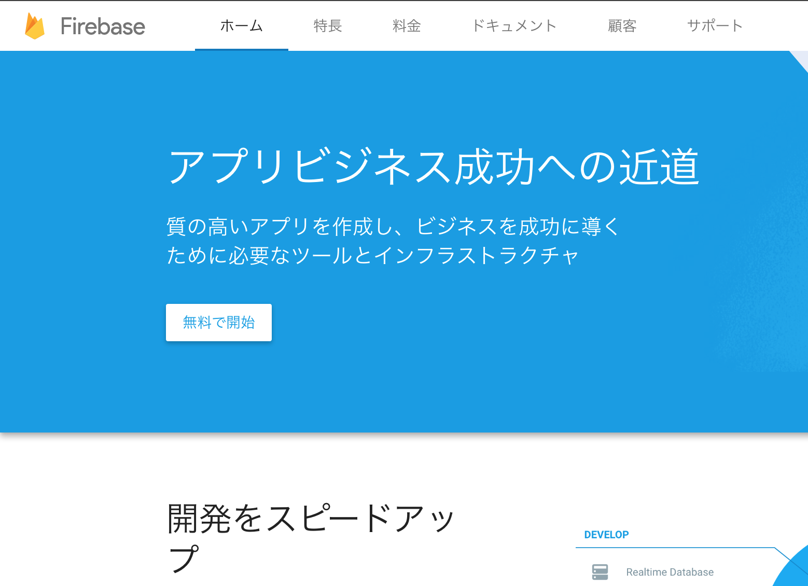
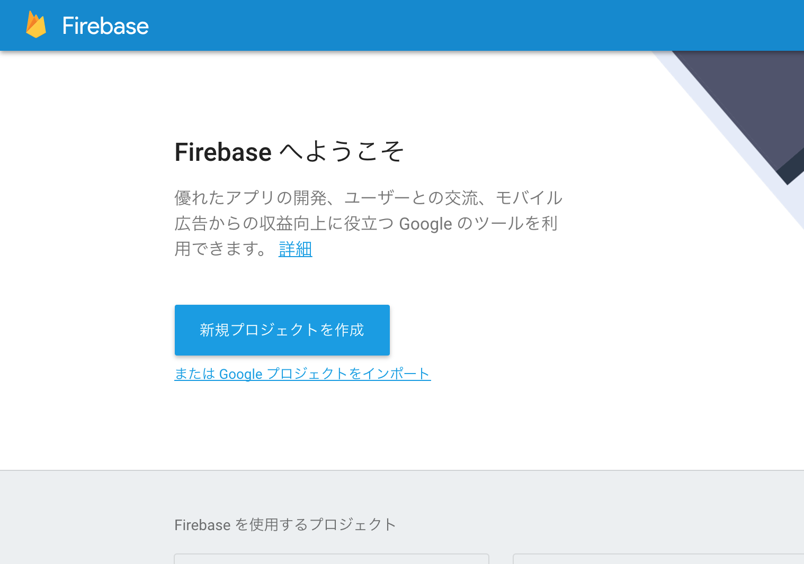
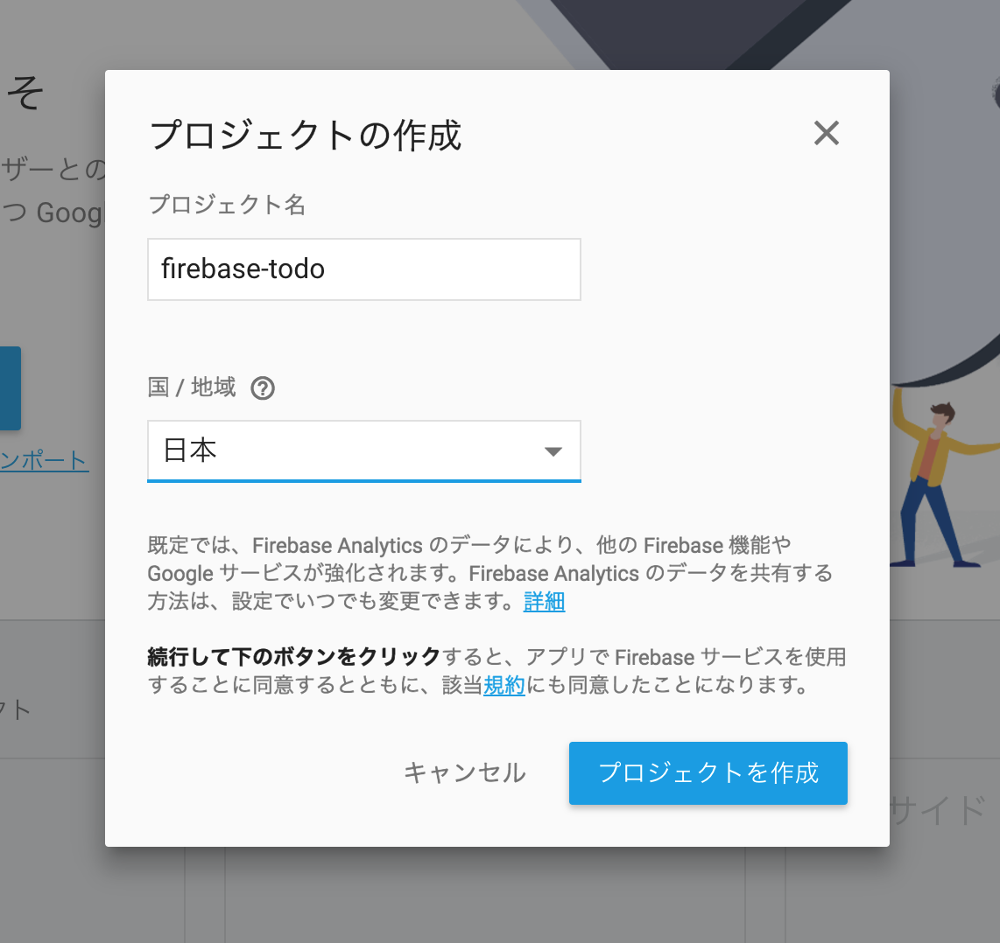
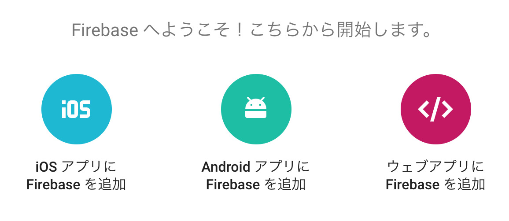

Firebaseのセットアップ
=====================

## Firebaseプロジェクトの作成

1. [Firebase](https://firebase.google.com) へアクセス
2. 
3. 
4. 

## Firebase SDK インストール

```
npm i -S firebase
```

> `npm i` = `npm install`

## 初期化コードの反映

1. 初期化コード確認
  - 
1. init_firebase.js 作成
  - ↓理由からFirebaseの初期化処理を別ファイル化
    - 初期化コードを公開するのを避ける
      - init_firebase.js は `git ignore` しています
    - 環境の切り替えができるように
1. app.js にインポート
