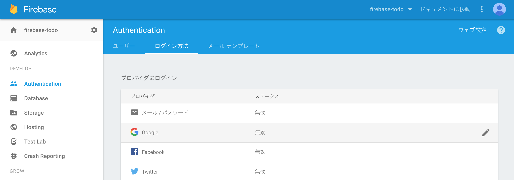
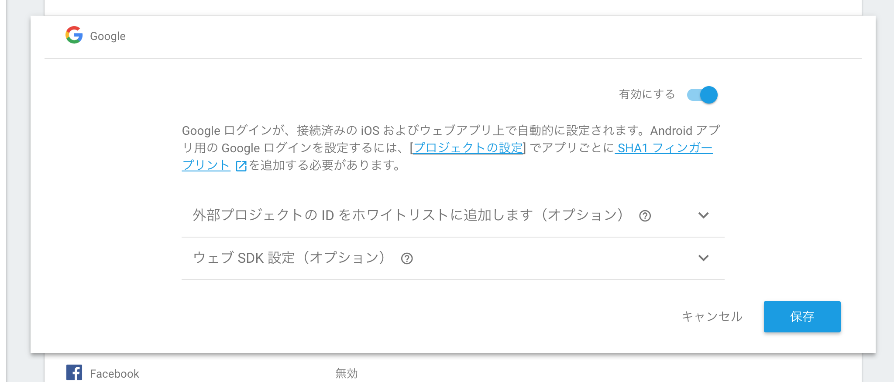

ログイン
===================

- Googleアカウントでソーシャルログイン（認証連携）
- https://speakerdeck.com/heki1224/firebase-authentication

## Googleログインのセットアップ

https://firebase.google.com/docs/auth/web/google-signin

1. 
1. 

## ログインビュー UI調整

いい感じのログイン画面にしてください

## ログイン機能実装

1. ログインボタンのハンドラー確認
  - `handleTouchTap`
1. firebaseインポート
1. プロバイダー作成
1. ログイン処理追加
  - *リダイレクト方式じゃないとiOS/Androidで認証がうまく動かない*

## 認証状態の確認

1. compnentWillMount
  - ComponentがDOMツリーに追加される前に一度だけ呼ばれます
  - http://qiita.com/koba04/items/66e9c5be8f2e31f28461
1. firebase.auth().getRedirectResult
  - リダイレクト後の認証状態を確認
  - Promise
    - http://qiita.com/progre/items/03626b7f4655007d8cb2
    - *Firebaseの非同期処理はPromiseでだいたい返る*
  - ES2015のfunction

## 認証状態によってビュー切り替え

1. renderでコンポーネントの切り替え
  - render内の`{}`でjs実行
1. stateでビュー切り替え
  - コンポーネントを変数へ切り出し
