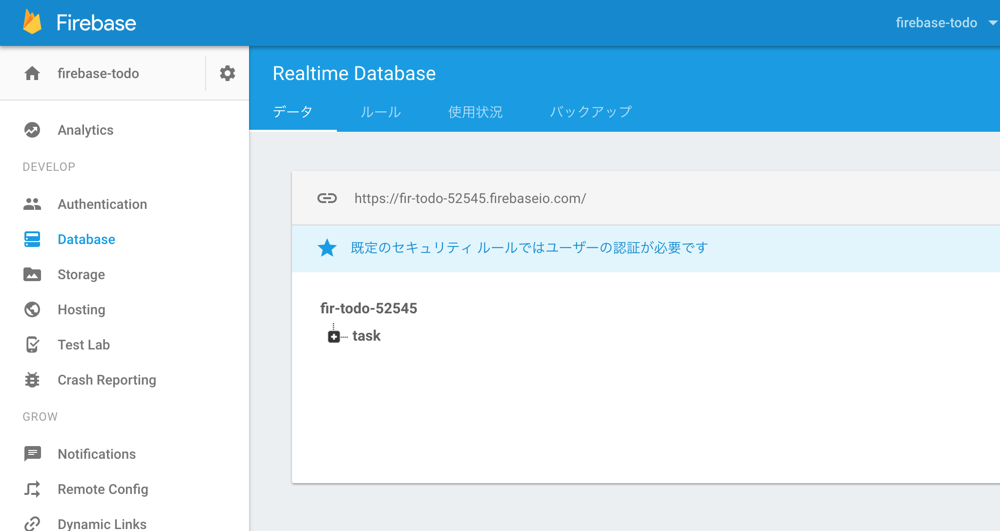

タスク表示・追加・変更・削除
==========================

https://github.com/koizuss/firebase-todo/compare/1-1_LOGIN...1-2_TASK

## タスク表示・追加・変更・削除 UI調整

> Material-UI・Reactの使い方がメイン

- トップビューの切り出し
- タスクリスト表示
  - Card
- タスク追加ボタン
  - Floating Action Button
  - アイコン
- タスク追加フォーム
  - Material-UIのダイアログはハマる件
    - http://qiita.com/koizuss@github/items/ddd656cbafd888f179d6
    - http://qiita.com/koizuss@github/items/3cc189f22cdd6f6047cc
  - 追加ボタンクリックでフォーム表示
    - onTouchTap
  - Text Field
    - 入力データのバインド
      - onChange
      - value

## タスクのCRUD

Firebase Realtime Database

- サービスクラスの作成
  - Firebaseとの結合度を下げる
- タスクデータ追加
  - https://firebase.google.com/docs/database/web/structure-data
  - ドキュメントベースのデータ構造
    - JSONを格納
    - RDBみたいな行・列の概念ではない
    - 入れ子もOK
    - 管理(CRUD)したいオブジェクトの単位でエンティティを切る
    - MongoDBみたいな感じ
  - pushでkeyを取得してupdate
    - https://firebase.google.com/docs/database/web/save-data
  - トランザクション
    - updateの引数が基本的なトランザクションの単位
    - 破壊的なデータ変更は#transactionで
      - 後勝ちが許容されないデータとか
  - Promise
    - 保存完了待ちやローディング、スネークバー（トースト？）に利用できる
  - コンソールでデータを確認
    - 
- タスクデータの取得
  - https://firebase.google.com/docs/database/web/retrieve-data
  - EventEmitter
    - on / off / once
  - snapshot.valは常にオブジェクトを返却
    - リストもオブジェクト（ハッシュマップ）が返却される
    - Object.keys
      - IEは未対応
        - https://developer.mozilla.org/ja/docs/Web/JavaScript/Reference/Global_Objects/Object/keys
        - [babel-polyfill](https://babeljs.io/docs/usage/polyfill/)とかで対応
    - WebSoket標準対応なので同じデータを見ているヒト全てに更新が即時反映される
- タスクデータの削除・更新
  - サービスのリファクタリング
  - ボタンクリックイベントでのkey取得
  - Read対象データが無い（無くなった）場合、snapshot.val()はnullを返す

## (その他調整)

- 詳細の改行調整
- カードの表示調整
