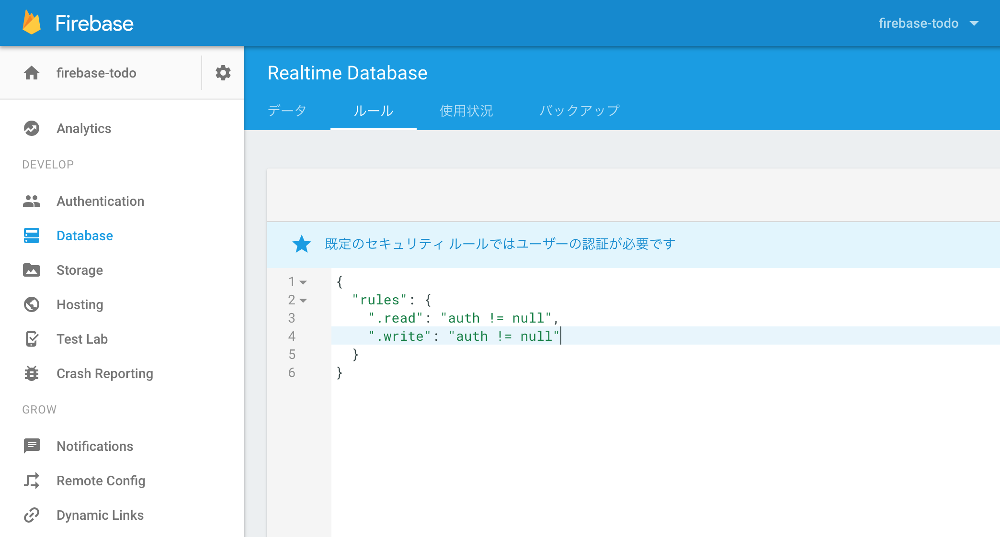

セキュリティ設定・デプロイ
==================

## セキュリティ(データの検証)設定

### 仕様確認
  - https://firebase.google.com/docs/database/security/
  - 
  - デフォルトで認証済ユーザーのみ許可
  - 各要素毎に指定可能
    - JavaScriptで条件を指定、結果が true:許可/false:拒否
    - 条件判定コード内で以下のデータが参照可能
      - 認証ユーザーを参照可能: auth
      - 反映データ（新/旧）を参照可能: newData / data
      - パスに含まれた値（keyなど）を参照可能: `$` を付けて変数として定義
      - データベースに格納されたその他のデータを参照可能
      - 他にも
        - https://firebase.google.com/docs/database/security/securing-data
  - その他セキュリティのドキュメントはデータの構造を決める参考になる
    - https://firebase.google.com/docs/database/security/user-security

### セキュリティ設定

- デフォルトでは認証していれば誰でもreadできる設定になっている
- readは登録した本人しか見れない仕様にする

## デプロイ

### Firebase tools インストール

Firebase tools: Firebaseを操作するためのCLIツール

- https://firebase.google.com/docs/cli/?hl=ja

```
npm i -D firebase-tools
$(npm bin)/firebase --help
```

### Firebase tools でログイン

  $(npm bin)/firebase login

### プロジェクトディレクトリを初期化

ローカルディレクトリをデプロイ用に初期化

```
$(npm bin)/firebase init
```

1. `Hosting: Configure and deploy Firebase Hosting sites` を選択
1. 今回作成したFirebaseプロジェクト名を選択
1. 後はデフォルトでいいのでEnter連打

#### 初期化時に作成されるファイル

- .firebaserc
  - プロジェクトのメタデータ
- database.rules.json
  - データベースルールファイル
  - 今後は基本このファイルを編集してデプロイする流れ
  - **間違うとルールが全部消えるとかあるので注意** （後述）
  - セキュリティホールになりかねないのでパブリックなリポジトリでは公開しない方が吉
- firebase.json
  - プロジェクトディレクトリの設定ファイル
- public/
  - Hostingされる静的ファイルを格納する用のディレクトリ

### ビルド成果物出力先を調整

webpackの設定を変更

- webpack-dev-server.config.js
- webpack-production.config.js

### ビルド

  npm run build

- `plublic/` に各種ファイルが出力されていることを確認

### デプロイ

  $(npm bin)/firebase deploy

コンソールに表示される `Hosting URL` にアクセスすると作成したアプリが使える（はず）

*お疲れ様でした！！*

#### ※※※デプロイ時の注意！！！

上記 `firebase deploy` コマンドはローカルの `./database.rules.json` でクラウド上のルールを **問答無用で上書き** します。
データベースルールはセキュリティリスクがかなり高いです（とゆーかデータを守る唯一の手段です）。
ローカルファイルが間違った状態で知らずに上がってしまったみたいなケースは十分に注意してください。

> ちなみに僕はそこそこ完成形のルールを1度白紙に戻しました。（リポジトリでも管理していなかったので涙すらでませんでした）

デプロイはコマンドオプションでデータベースルール反映をスキップできます。

```
$(npm bin)/firebase deploy --only Hosting  # Hosting資材のみデプロイ
```

デプロイは↑のみで対応し、ルールはコンソールでしか変更しない運用とかもありです。
（間違ってオプション無しで叩かないよう、CIツールでデプロイする等の検討が必要）
